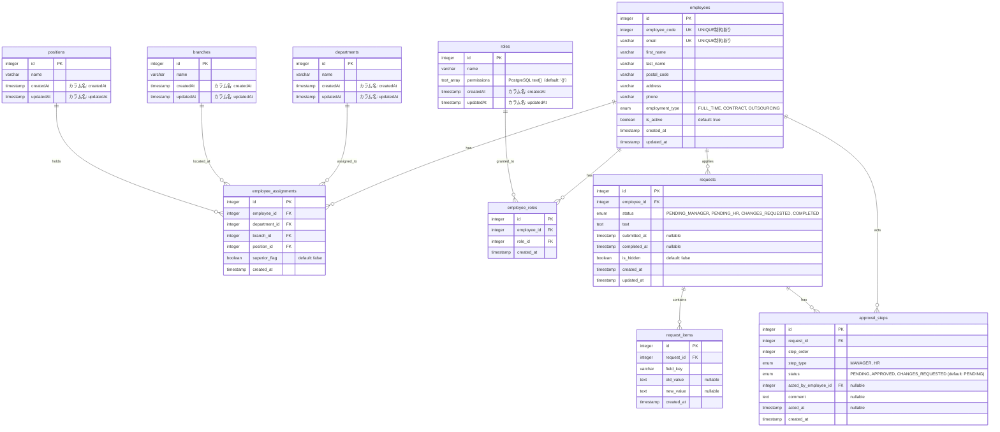

# ER図

## HRシステム データベース設計

## テーブル説明

### マスタテーブル

- **departments** - 部署マスタ（営業部、開発部、CS部、管理部、人事部）
- **branches** - 支店マスタ（東京支店、大阪支店、福岡支店）
- **positions** - 役職マスタ（平社員、主任、部長、社長）
- **roles** - 権限ロールマスタ（権限名と権限配列）

### トランザクションテーブル

- **employees** - 従業員情報
- **employee_assignments** - 従業員の所属情報（支店×部署×役職の組み合わせ）
- **employee_roles** - 従業員の権限ロール（多対多）
- **requests** - 申請情報
- **request_items** - 申請項目（変更内容の詳細）
- **approval_steps** - 承認ステップ（上長承認、人事承認など）

## リレーションシップ

- **employees** 1:N **employee_assignments** - 1人の従業員は複数の所属情報を持つ（異動履歴）
- **employees** 1:N **employee_roles** - 1人の従業員は複数の権限ロールを持つ
- **employees** 1:N **requests** - 1人の従業員は複数の申請を作成できる
- **employees** 1:N **approval_steps** - 1人の従業員は複数の承認ステップで承認者になる
- **departments** 1:N **employee_assignments** - 1つの部署には複数の従業員が所属
- **branches** 1:N **employee_assignments** - 1つの支店には複数の従業員が所属
- **positions** 1:N **employee_assignments** - 1つの役職には複数の従業員が就任
- **roles** 1:N **employee_roles** - 1つの権限ロールは複数の従業員に付与される
- **requests** 1:N **request_items** - 1つの申請には複数の申請項目がある
- **requests** 1:N **approval_steps** - 1つの申請には複数の承認ステップがある
